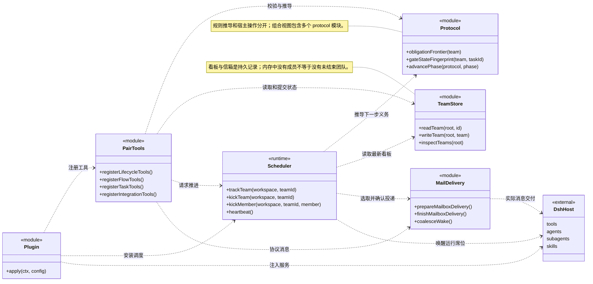
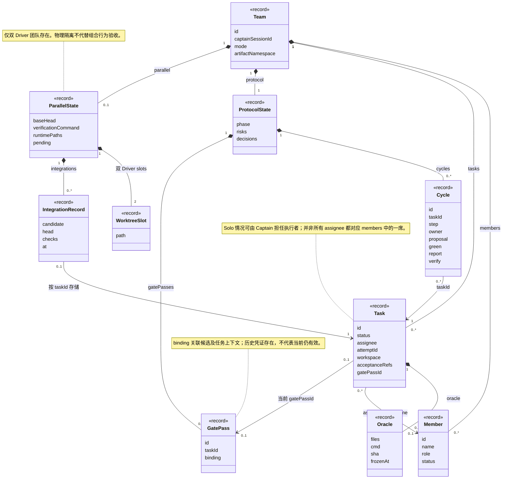
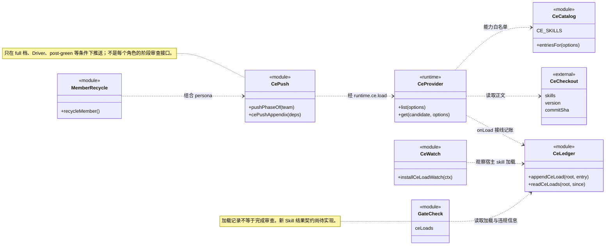
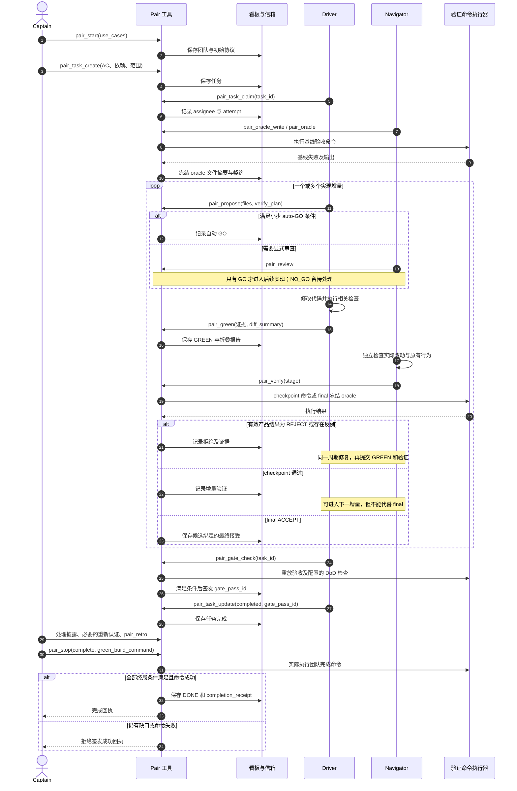
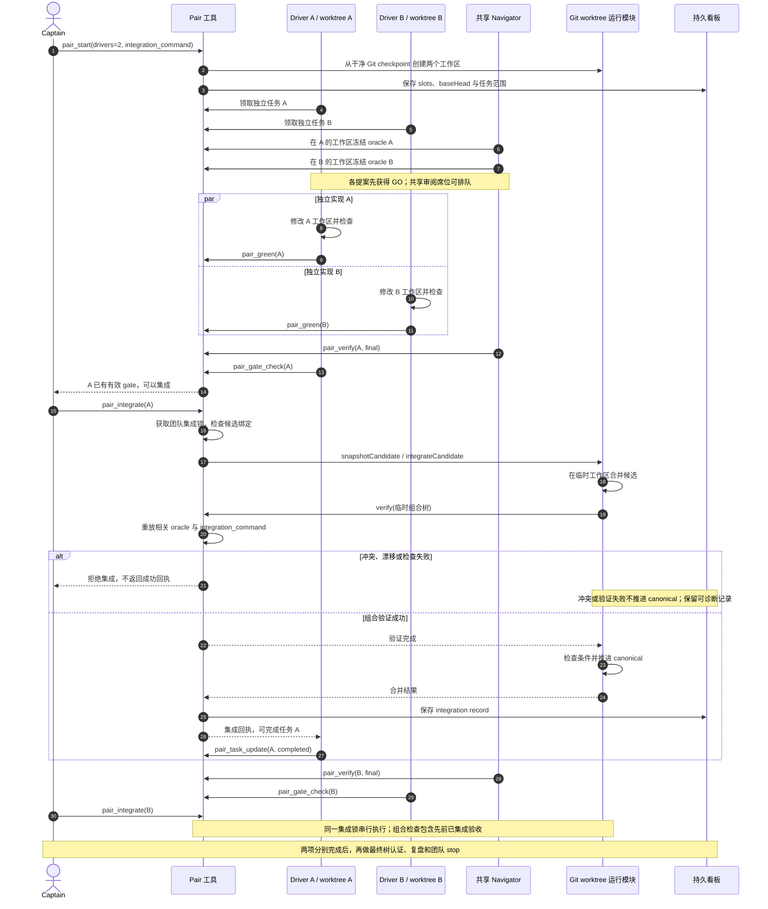
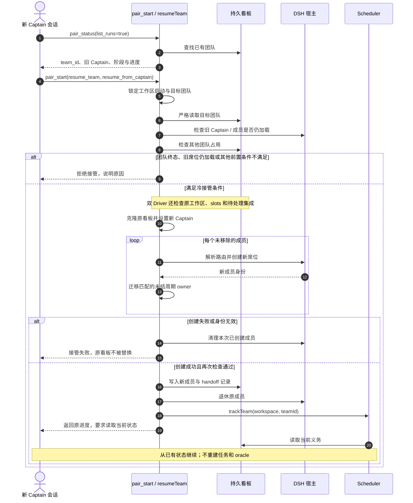

# Pair Programming · 功能 UML 图集

实现快照：`408196b`，编制日期 2026-09-11。六张 Mermaid UML 图，中文说明配英文实现名称，适合架构讲解及功能汇报。

**读法：** 当前项目以 ES modules、函数和普通对象实现。类图中的 `<<module>>` 是模块的逻辑接口视图，`<<record>>` 是持久化数据结构，`<<runtime>>` 是运行时对象；不意味着源码定义了同名 JavaScript class。实线箭头表示关联，虚线箭头表示依赖，实心菱形表示记录中的组成关系。角色是运行席位，不通过继承关系表达。为可读性省略非关键字段、锁细节和消息；时序图展示主要合法路线，不是逐调用日志。

## 01 · 类图：插件如何组织运行

**讲解重点：** 工具处理用户和角色请求，协议模块推导规则，调度器通过宿主与信箱交付工作，状态存储承载事实。

实现依据：`lib/index.js`、`lib/tools/shared.js`、`lib/runtime/scheduler.js`、`lib/runtime/mail-delivery.js`、`lib/state/store.js`。

## 02 · 类图：任务、周期与完成证据

**讲解重点：** Task 完成、Cycle 验收和团队 DONE 是三个不同层次。Task 通过 ID 引用凭证；Cycle 和 GatePass 实际保存在 ProtocolState 中。

实现依据：`lib/protocol/machine.js`、`lib/tools/task.js`、`lib/protocol/gate.js`、`lib/runtime/worktrees.js`、`lib/tools/integrate.js`。关联基数表达正常运行记录，不替代存量数据校验规则。

## 03 · 类图：当前 CE 集成边界

**讲解重点：** 现有 CE 是可选技能目录、加载记录及窄范围推送；尚不是计划 L 中可替换的通用审查结果接口。

实现依据：`lib/integrations/ce-provider.js`、`ce-catalog.js`、`ce-push.js`、`ce-watch.js`、`ce-ledger.js`、`lib/runtime/recycle.js`、`lib/tools/arbitrate.js`。

## 04 · 时序图：单 Driver 的验收优先循环

**场景：** light 模式，一位 Driver 与一位 Navigator；采用先领取、再冻结 oracle 的合法路线。单工作区也允许在受约束的窗口提前准备验收。

边界：取消、候选漂移、基础设施错误可能直接拒绝验证调用，不应当作产品 REJECT；oracle-first 的 GREEN 已携带报告，不强制再走单独 REFACTOR。消息由调度/投递层交付，此图省略每一次唤醒。

## 05 · 时序图：双 Driver 并行与串行集成

**讲解重点：** 实现可并行；共享 Navigator 的审阅与 Captain 的集成不是两个同时运行的独立席位。任一任务就绪即可请求集成，不强制等待另一席。

这是 A 先就绪的一种调度顺序，B 可以先集成。低层文件操作与看板持久化仍有各自失败边界，此图不宣称跨 Git 与 JSON 存储存在数据库式原子事务。

## 06 · 时序图：新会话冷接管已有团队

**讲解重点：** 接管保留工作成果，替换运行成员身份；不是重新建项目。仅演示显式 `resume_team`，原 Captain 的自然恢复是另一条入口。

恢复只迁移符合当前 task / attempt 条件的未结周期拥有者；已接受的历史证据保留。旧会话失权和实际宿主兼容性需要相应验收，图示不能替代运行证据。

## 展示范围与当前限制

- 图 01、02、04、05 用于介绍主要功能；图 03、06 用于解释扩展边界与恢复语义。
- 新 Skill 的通用结果契约、来源替换和阶段触发仍属于计划 L，不画成已实现功能。
- 本轮此前审查发现的暂停心跳竞态、损坏看板占用扫描、根目录运行数据复制问题，不能由这些功能图推定已修复；修复状态需另行核对。
- 这里展示的是当前实现，不是经过重新设计的理想架构。后续重构时应更新关系和失败分支，不能只更新版本文字。
