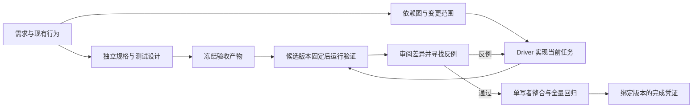

# DSH 插件是否值得继续：正确率优先的调研与重构决策

检索日：2026-09-07。用户目标：尽量提高正确率，接受更长耗时。代码基线：bc154a8，工作树 package 0.13.10。本文把论文观察、项目实证、设计推论分开；实施结果另记在 diagnostics 中。

## 判断

值得做一次有退出条件的方向调整。目前不能声称这个插件提高了代码修复正确率。值得保留的产品价值是：独立验收、能够追溯的证据、可恢复的执行和明确的整合责任。频繁 GO/REPORT/ACCEPT 不是护城河。

若最终只是让廉价模型经常复述强模型的方案，这个方向的价值很弱。若能在真实仓库任务中稳定抓到单代理漏掉的缺陷，而且不会被调度与消息拖垮，就有继续投入的理由。接受更慢不等于接受无效循环；额外时间应花在新增证据上。

用户提供的 [Bilibili 视频](https://www.bilibili.com/video/BV1UvbL6vEbM/) 未能核实全文：公开接口返回 412，本机未安装字幕读取后端，搜索没有取得可验证字幕。以下没有转述视频作者观点，仅回应用户描述的问题。

## 本地证据比角色名称更重要

历史材料：`exp/capability-map/FINAL-EXPERIMENT-REPORT.md`。五个原始实例中两种方法逐例相同，报告记载可评估 F2P 为 3/5；另一个环境阻塞实例被排除。优化试验又出现 O3：goal 成功，而 pair 因信箱唤醒停滞超过时间上限失败。样本小、两臂计时口径不齐、环境和交叉污染限制已在原报告披露，不能据此计算普遍胜率或显著性。`exp-large-task-benchmark/results/results.csv` 只有表头，不能把它算成已经跑过的大任务证据。

本轮在重构前代码中确认的因果链（落地情况见 [实施证据](../diagnostics/2026-09-07-orchestration-implementation.md)）：

- `protocol/obligation.js` 只读全队最后一个 cycle，随后只读第一张活跃卡。局部任务的并行状态被压成一个全局接力棒，较早工作能被遮住。
- `protocol/attention.js` 用 team.updatedAt 标识重复债务；scheduler 的心跳、席位状态、resume 记录也更新团队。这些元数据写入可能把同一失败当作新任务、刷新重试预算。
- `runtime/scheduler.js` 补投全部未读消息，成员逐一等待，没有单次字节预算；`tools/shared.js` 还可直接向正在运行的成员持续注入消息。仅优化磁盘 append 不会解决模型上下文过载。
- 本轮离线复现：给 1,000 条模拟 GREEN 回执各附 2,000 字符 evidence 和真实投递会追加的 `[PAIR:NEXT]`，解析器读不到 JSON body，合并数为零，fallback prompt 为 2,123,204 UTF-8 字节。这是合成负载，不能写成线上观测；它证明现有合并单测遗漏了真实消息格式。
- `pair_verify` 已有冻结 oracle 与重跑，但其 oracle 路径忽略显式 reject，测试外的真实问题难以阻止 computed ACCEPT；异步重跑与落盘之间还需要验证任务、循环和候选代码仍是同一份。

这里没有重新立项已经修复的启动、孤儿、heartbeat 恢复或未知 session event 问题。

## 论文证据表

选择原则：以原论文、作者项目和正式会议页面为来源，同时纳入支持与反对多智能体的结果。重点读方法、消融和局限；摘要级阅读明确标注。不同论文的旧模型分数不能直接外推到本机模型。

| 论文与阅读范围 | 观察 | 对插件的设计推论与边界 |
|---|---|---|
| [Agentless，2407.01489v2](https://arxiv.org/html/2407.01489v2)，§3.3、§5.2.3 | 定位、候选补丁、测试筛选的简单流程有效；SWE-bench Lite 消融中，投票 77 个修复，加回归测试 81，再加复现测试 96。生成复现测试本身也有错误。 | 优先做候选验证与回归证据，不以角色数量代替质量；采用外部留出测试评价 oracle，而不是拿 oracle 自证。这里的样本与补丁采样预算不同于本插件，不能照搬成功率。 |
| [AgentCoder，2312.13010v3](https://arxiv.org/html/2312.13010v3)，§3、§4.7 | 测试设计者不看生成的实现；执行器是脚本，不需要第三个模型判断退出码。研究覆盖 HumanEval/MBPP 等函数级任务。 | Navigator 先从需求独立设计验收、边界与大输入测试。执行交给程序。此证据支持信息独立性，不证明大型跨文件改造一定受益。 |
| [SWE-agent，2405.15793v3](https://arxiv.org/html/2405.15793v3)，§3、§5.1 与消融表 | 工具反馈、编辑守卫和上下文窗口影响同一模型表现；全历史并非最佳，简洁有效的操作有价值。 | 工具返回当前状态、明确下一动作和失败原因；信箱不能充当无限上下文。论文测试的是 ACI，不直接证明本方案的字节阈值。 |
| [Large Language Models Cannot Self-Correct Reasoning Yet，2310.01798](https://arxiv.org/abs/2310.01798)，摘要与研究问题 | 没有外部反馈的内在纠错不稳定，有时反而变差。 | 不把“再审一次”当独立证据。并不否定有真实测试结果的调试，也不是所有后续模型能力的定理。 |
| [Why Do Multi-Agent LLM Systems Fail?，2503.13657v1](https://arxiv.org/html/2503.13657v1)，方法与分类 | 此版本分析五个框架、150 条轨迹，归为规格/系统设计、代理间错位、验证/终止等 14 类。干预未清除全部失败。 | 把旧任务投递、责任不清、未验证终止分别测量；不能把所有失败归因于便宜模型。版本统计不与后续 MAST 扩充数据混用；分类研究不是本地根因证明。 |
| [Towards a Science of Scaling Agent Systems，2512.08296v1](https://arxiv.org/html/2512.08296v1)，设计、结果与§5 | 比较 180 个配置；任务可分解性、工具负担和协调拓扑影响收益。顺序任务和可并行任务表现不同。 | 并行判断依据依赖图与共享资源；不根据固定角色数扩容。其模型、任务和经验阈值不是通用定律，尤其不能把文中能力阈值硬编码成 Navigator 开关。 |
| [Should we be going MAD?，ICML 2024](https://proceedings.mlr.press/v235/smit24a.html)，会议摘要 | 多轮辩论未可靠胜过 self-consistency/ensemble；调参后部分方法更好，具有敏感性。 | 不设“每轮必须提出意见”的配额；允许充分验证后的 clean pass。不是证明辩论一律无用。 |
| [Debate or Vote，2508.17536v2](https://arxiv.org/html/2508.17536v2)，实验、异质角色与开放任务 | 多数收益常由初始独立候选聚合解释；改变 persona 不保证增加收益。主要任务是封闭答案问答。 | 先独立产出反例/候选，再进行有证据的仲裁。代码正确性不能由多数投票决定，一条可复现反例可以否决多数赞成。 |
| [Improving Factuality and Reasoning through Multiagent Debate，2305.14325](https://arxiv.org/abs/2305.14325)，摘要 | 在所研究的推理与事实任务上，交流与批评能带来改善。 | 保留针对真实歧义的有限讨论。这是反向证据，不能为了支持“减角色”而省略；也不能直接外推到并发改仓库。 |
| [Multi-Agent Collaboration via Evolving Orchestration，2505.19591](https://arxiv.org/abs/2505.19591)，摘要 | 用训练的集中编排器调整交互，报告更紧凑的组织结构与效果。 | 静态角色分配并非唯一选择；先实现可观测的确定性调度。没有训练数据和同预算实验时，不能宣称几条规则复现了 RL 编排收益。 |
| [SEDA，SOSP 2001](https://www.cs.princeton.edu/courses/archive/fall04/cos518/papers/seda.pdf)，§1–3 | 显式队列、阶段资源控制和批处理用于过载时维持服务能力。 | 按席位限制投递量、把通知与产物分开、保留积压可见性。借鉴的是系统控制原理，不照搬网络服务的性能数字；不能丢弃纠错消息来“减负”。 |
| [Time, Clocks, and the Ordering of Events，1978](https://www.microsoft.com/en-us/research/publication/time-clocks-ordering-events-distributed-system/)，作者说明 | 时间先后与因果关系不同；事件只有部分顺序。 | 身份用 task/attempt/cycle 和证据摘要，不能只用墙钟判断新鲜度。我们不需要实现分布式共识；单机锁与条件提交足以解决当前大部分交错。 |

综合结论是工程推论：新增有独立信息来源的检查，并用机制保护检查对象不变；没有任何一篇论文直接验证了这个 DSH 实现。

## 目标架构

### 审阅职责

1. 规格阶段：列出存在分歧的需求解释，以及足以区分它们的可运行用例；要求覆盖需求和已有行为。测试需要能在原状态揭示目标问题，不能只检查新文件存在。
2. 实现阶段：让 Driver 完成一个可独立验证的变化。Navigator 可以在当前候选进入 GREEN/审阅前，准备下一张依赖已满足卡的 oracle，或调查当前需求的反例；当前验收窗口暂停下一任务的文件写入，避免使候选摘要失效。它的消息应给出证据，不实时指挥每个编辑动作。
3. 验收阶段：冻结候选，运行测试与回归，再读真实 diff。存在明确反例时应允许拒绝，即使当前 oracle 为绿。测试红也须区分产品失败和工具/环境故障。
4. 整合阶段：只认证实际验证过的任务尝试与候选；变更后重新验证。保留未验证范围，不以测试数量当正确率。

不自动将廉价 Navigator 设为“质量保证”。选模型应做交叉设计实验：同模型独立上下文、较强 reviewer、不同模型 reviewer。不同厂商不自动代表独立错误；persona 差异尤其不能算能力互补证据。

对于当前“可选 Navigator”，建议把功能拆清：独立测试设计、程序执行、最终差异审阅是三种责任。质量优先时，默认保留独立测试设计和最终审阅；小改动可跳过事前 GO，正常实现过程不需要不断重述方案。solo 的独立 SPEC 加程序执行有价值，但由实现者兼做最终差异审阅，仍缺少另一人的反例视角。本轮没有宣称已实现 M4 自适应审阅降频；审阅频率与模型分配应在相同任务、相同预算和最终错误率下做下一轮消融，不能根据“连续几轮没提意见”直接证明可以撤掉审阅。

### 并行边界

当前先支持不同席位的独立工作并发，并修复全局接力棒和投递阻塞。一个共享目录仍只有一个生产代码写者。

真正多 Driver 的下一版需要每个 worker 独立 worktree：合同至少包含 task_id、attempt_id、base_commit、spec_digest、read_set、write_set、acceptance_command、artifact_ref。调度只发放依赖已满足且读写不冲突的工作。两个 write_set 不交叉仍不够：共同 schema、导出接口、锁文件、迁移、测试数据库及端口都算冲突。

worker 返回候选补丁与证据，由唯一 integrator 按依赖顺序整合。base/spec 已变则重新评估、必要时重做；不能仅因补丁可以 clean apply 就复用旧 ACCEPT。失败可丢弃隔离候选，不回滚别人的共享工作。先限制两个代码 worker，并用真实任务证明净收益后再扩。

### 信箱语义

产物在文件/看板，信箱用于提示谁需要读什么。保留 at-least-once 交付，操作依靠任务尝试和条件提交抵抗重复。每次读取限制数量与 UTF-8 字节，超过限制的记录仍留在 durable mailbox；过大的单条给出明确读取入口，不能默默截掉拒绝理由。

控制消息优先但不无限饿死普通邮件。租约是投递尝试的身份，不是一个能被旧 ACK 误清的时间戳。运行中的普通回执等待空闲或合并；每个运行轮次只允许一个有界紧急通知批次，额外纠错保留到下一轮，紧急停机仍用现有 pair_interrupt 手闸。重新投递时从当前看板生成待办；历史消息中的 NEXT 是历史信息。这里限制的是单次模型通知，历史 JSONL 的全量读写与磁盘增长仍需后续索引/分段存储治理。

## 如何证明改进，而不是自我说服

先用离线故障测试证明安全属性：不会凭旧结果通过，不丢控制消息，不重复兑现过期投递，不因一次心跳刷新重试预算，不因一个席位卡住阻止另一个。它们证明协议行为，不证明模型更聪明。

随后使用固定仓库版本与隔离环境进行成对实验，保留所有超时和协调失败。三臂：A 强单代理+相同工具；B 当前 pair；C 重构 pair。再做 C 的独立 oracle、review veto、并行开关消融。按任务难度和可分解性分层，至少覆盖单文件修复、跨模块功能、共享接口变更、并发/恢复问题。先做 12 个开发任务找流程缺陷，再使用事先冻结的 30 个留出任务、每臂三次；这个规模是起点，不是统计显著性的保证。

主指标：隐藏行为测试通过且没有已有行为回归的任务比例；同时报告错误 ACCEPT 率、人工确认的 P0/P1 逃逸、oracle 错误率、停滞率。附带记录总墙钟、token、回退次数、最大未读量和消息字节。测试与评判者不可读取金补丁；调参不能碰留出用例。报告每例配对差异及区间；样本不足时明确不确定。采用质量优先的充足上限对照，同时再给等 token 预算对照，防止把“花更多钱”误认为协作优势。

退出条件：若在冻结留出集上独立验收仍不能降低错误 ACCEPT 或提升最终正确率，且协调停滞反复存在，就停止扩建角色系统，把成熟部分收缩成单代理也可用的验证/恢复插件。不要用更多规则延长一个没有增益证据的假设。

## DSH 兼容性

核对 [官方 subagent 接口](https://github.com/deepseek-ai/deepseek-harness/blob/d347e703908d0406b7a7ef80e3a0e594d86b2215/packages/subagent/subagent/src/index.ts)（检索时默认分支 master、HEAD d347e703）与本地安装包 @deepseek-ai/dsh-subagent@0.1.2-rc.1 的类型/实现。实际 wake seam 是 ctx.subagents.sendMessage；宿主受理消息不等于工具执行完成。验收必须包括本地 cohort 的实际 DSH 运行，startup/import 合约测试只是前置检查；不假设 GitHub 最新接口已经安装。按用户指定使用 OpenCode Go / muse-spark-1.3-contributor，真实运行记录见 [native DSH 验收](../diagnostics/2026-09-07-native-dsh-acceptance.md)。本次不升级宿主，也不触碰承载会话恢复的未知事件过滤器。
